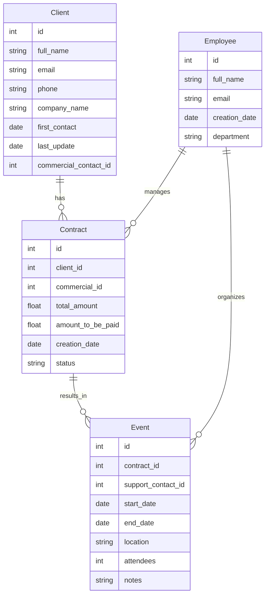

# OCP12
# Projet démarré
## in progress

## Résumé du cahier des charges

- **Entreprise**: Epic Events, organisateur d'événements
- **Objectif**: Développer un logiciel CRM en Python 3.9+ pour la gestion des clients, contrats et événements.
- **Départements concernés**: Commercial, Support, Gestion
- **Sécurité et contraintes techniques**: Pas d'injections SQL, principe du moindre privilège, journalisation avec Sentry.
- **Livraison**: Dans un mois, en ligne de commande, avec une documentation d'implémentation.

### Données à gérer

- **Clients**: Nom, Email, Téléphone, etc.
- **Contrats**: ID unique, infos sur le client, montant, etc.
- **Événements**: ID, ID du contrat, nom du client, etc.

### Fonctionnalités

- **Tous les collaborateurs**: Accès en lecture seule à toutes les données
- **Équipe de gestion**: CRUD sur les collaborateurs, contrats et événements
- **Équipe commerciale**: Gestion des clients et contrats
- **Équipe support**: Filtrage et mise à jour des événements

---

## Quelques idées pour le guide d'implémentation

### Architecture générale

- Utiliser un modèle MVC (Modèle-Vue-Contrôleur) pour séparer les responsabilités
- Base de données POSTGRES SQL pour un prototype rapide (en gardant à l'esprit les contraintes de sécurité)

### Authentification

- Utilisation de jetons JWT pour authentifier les collaborateurs

### Département Commercial

- Interface en ligne de commande pour ajouter/mettre à jour les clients et contrats
- Filtres de recherche pour les contrats non signés, etc.

### Département Support

- Interface pour filtrer et mettre à jour les événements qui leur sont attribués
- Notifications pour les changements d'état des événements

### Département Gestion

- Interface admin pour la gestion des collaborateurs, contrats et événements
- Filtres pour afficher les événements sans support, etc.

### Sécurité

- Utilisation de requêtes paramétrées pour prévenir les injections SQL
- Implémentation du principe du moindre privilège via des rôles et permissions

### Journalisation

- Intégration de Sentry pour capturer les erreurs et exceptions

# Diagram
