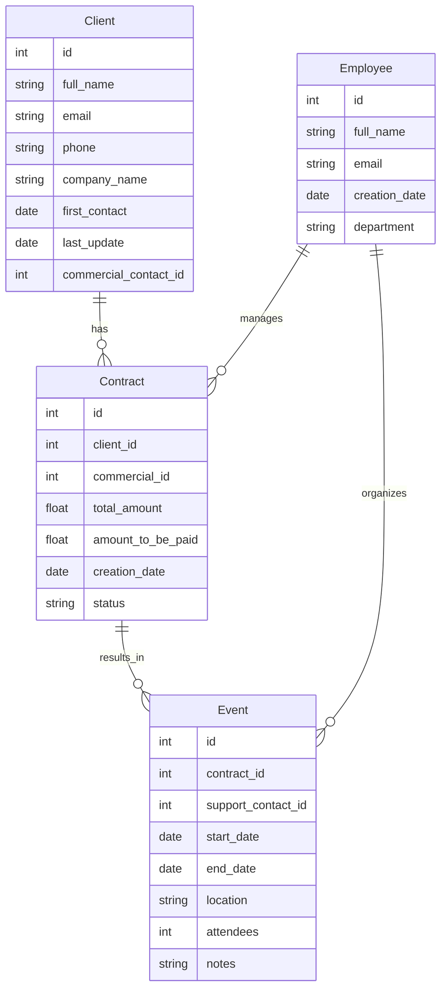

# OCP12

```mermaid
erDiagram
    Client ||--o{ Contract : has
    Employee ||--o{ Contract : manages
    Employee ||--o{ Event : organizes
    Contract ||--o{ Event : results_in
    Client {
        int id
        string full_name
        string email
        string phone
        string company_name
        date first_contact
        date last_update
        int commercial_contact_id
    }
    Contract {
        int id
        int client_id
        int commercial_id
        float total_amount
        float amount_to_be_paid
        date creation_date
        string status
    }
    Employee {
        int id
        string full_name
        string email
        date creation_date
        string department
    }
    Event {
        int id
        int contract_id
        int support_contact_id
        date start_date
        date end_date
        string location
        int attendees
        string notes
    }

```